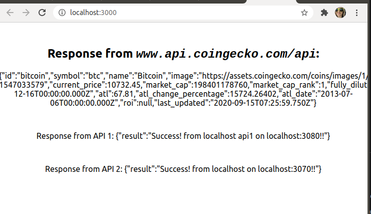

## create-react-app fetches three apis using http-proxy-middleware

This is a demo for to connect a create-react-app to multiple different ports on the localhost as well as to other webistes.

## to use this app

You must have node.js installed.




<code>
git clone https://github.com/svgpubs/react-with-multi-apis.git
</code>

Open three different mac/linux terminals, or windows powershell/command line

terminal 1: run the first localhost server
```
cd api1/
npm install
node server1.js
```
terminal 2: run the second localhost server
```
cd api2/
npm install
node server2.js
```

terminal 3: run the reactapp react app
```
cd reactapp/
npm install
npm start
```

A browser should popup. If not, go to localhost:3000

